# LWS Work Report & Backlog

**Single tracking file.** Everything done, everything pending, in one place.

**Branch:** `lws-implementation` · **Nothing committed, nothing pushed**
**Build:** clean · **Tests:** 2/2 passing · **Last updated:** after MDB map-size fix

**Goal:** stable, high-scale, production-ready LWS — serving many frontends
(mobile, web wallet, extension, private-token verification, third-party wallets),
fast enough that users feel it, thousands concurrent, continuous new signups,
multiple beldexd endpoints with no single point of failure.

---

## Contents

| § | Section |
|---|---|
| 1 | [Status at a glance](#1-status-at-a-glance) |
| 2 | [DONE — MDB map-size root cause](#2-done--mdb-map-size-root-cause) |
| 3 | [Proof](#3-proof) |
| 4 | [Files changed](#4-files-changed) |
| 5 | [**NEXT UP — immediate**](#5-next-up--immediate-finish-phase-0) |
| 6 | [Phase 1 — survive real conditions](#6-phase-1--survive-real-conditions) |
| 7 | [Phase 2 — remove the scanner ceiling](#7-phase-2--remove-the-scanner-ceiling) |
| 8 | [Phase 3 — concurrency & I/O](#8-phase-3--concurrency--io) |
| 9 | [Phase 4 — horizontal scale](#9-phase-4--horizontal-scale) |
| 10 | [Full defect register (F1–F21)](#10-full-defect-register) |
| 11 | [Scaling walls (S1–S8)](#11-scaling-walls) |
| 12 | [How to verify](#12-how-to-verify) |

---

## 0. Phase status — read this first

| Phase | Scope | Status |
|---|---|---|
| **Phase 0** | Crash/correctness fixes (F2, F3, F4, F6, F16; F22 withdrawn) | ✅ **complete** |
| **Phase 1** | Survive real conditions (F9–F20 cluster) | ✅ **complete** — except API-contract items |
| **Phase 2** | Scanner ceiling (S1, S2, S4) | ✅ **complete** |
| **Phase 3** | Concurrency & I/O (S5, S7, F7, F8, multi-daemon HA, multi-process tier) | ✅ **complete except S6** |
| **Phase 4** | Horizontal scale (S3, S8) | ⬜ **not done — architectural** |

**Three things are knowingly open.** None is a loose end; each is here for a reason:

| Open item | Why |
|---|---|
| **S3 / S6 / S8** (Phase 4) | Sharding and a write-batching redesign. Inherent to view-key scanning — ~10⁸ scalar multiplications per block at 1M users. A project, not a patch. |
| **F5** — IPC fetch lock | Narrowed from the full 60 s round-trip to the enqueue. Cannot be fully closed here: verifying it needs a beldexd built with OMQ enabled, which this rig does not have. |
| **F32** — `fork_version` hardcoded `17` | Feeds `estimated_tx_network_fee` in the WASM bridge — the fee path explicitly ruled out of scope. Changing it is a product decision. |

Everything else in this document is done and was verified running, not just written.

**New in this round:** `beldex-lws-backup` — scheduled hot backups with retention
and no LWS downtime (§16).

---

## 1. Status at a glance

**API contract verified preserved** — 9 deterministic endpoints byte-identical
before/after, error codes unchanged (404/405/500). The existing WASM client is
unaffected. **Fee calculation untouched** (LWS and daemon alike).

### Fixed and verified — 30 items

**Critical (silent fund/balance errors)**

| ID | Issue | Verified by |
|---|---|---|
| **F20** | Scanner used the LAST tx pubkey -> **every balance reported ZERO** | 0 -> 1802 outputs vs wallet2 |
| **F24** | Projection cache **doubled balances after rescan** | 3604 -> 1802 BDX |
| **F25** | Projection cache served **stale data after rescan** | 51.6 -> 1,400,000,051.6 BDX |
| **F26** | Decoy request capped at 20 inputs -> **any tx with >20 inputs impossible** | 21 amounts: 500 -> 200 |
| **F11** | Cross-account payment-ID leak | per-user decryption |
| **F1** | Version key unstable -> migration every boot | run1=1, run2=0, run3=0 |

**Availability**

| ID | Issue | Verified by |
|---|---|---|
| **F3** | Any transient error killed the daemon | survived beldexd kill+restart, backoff 16->32s |
| **F23** | Admin `rescan` silently ignored by a live scanner | "Rescan detected... restarting" |
| **F6** | Handler exceptions escaped into asio worker | try/catch -> 500 |
| **F17** | SIGTERM killed the process mid-transaction | clean exit |
| **F16** | `getenv("HOME")` crash before `main` | `env -u HOME` starts |
| **F9** | No network validation | mainnet-vs-testnet refused |
| **MDB** | Orphaned reader slots block page reclamation | 18,952 KiB -> 0 KiB; **"cleared 2 stale slots"** in live multi-process crash test |

**Scale**

| ID | Issue | Verified by |
|---|---|---|
| **S1** | Full account+output reload on every restart | `1 from DB, 3 reused` |
| **S2** | Redundant 32-byte pubkey vector per output | dropped; ~3x less RAM/output |
| **S4** | Every scan thread fetched the chain separately | shared 2s dedup; 4-thread scan correct |
| **S5** | Global spinlock on every LMDB txn | mutex+condvar; 60 concurrent requests, 0 errors |
| **S8** | No horizontal story | **1 writer + 2 reader processes on one LMDB verified** |
| **F2** | Daemon caches deep-copied per request | `shared_ptr<const T>` |
| **F7** | Migration buffered whole table in RAM | batched, 200k rows |
| **F8** | Cache `clear()` stampede | LRU eviction |
| **F19** | No response ceiling | opt-in; default unlimited |

**Correctness / hygiene**

| ID | Issue |
|---|---|
| **F13** | `rctSig` partial-optional deref (**UB**) |
| **F12** | `RCTType` parsed then discarded |
| **F4** | Login dropped `generated_locally`, threw on DB error (auto-create kept) |
| **F18** | `update()` hid DB errors as height skew |
| **F10** | `int` heights + unchecked JSON in `sync` |
| **F14** | `use_dust:false` behaved as `true` |
| **F15** | Uninitialised ring keys from ignored `hex_to_type` |
| **F21** | `run()` returned true on bind failure; 2 stray `main()` files removed |

### Not done — and why

| ID | Item | Reason |
|---|---|---|
| **F5** | IPC fetches serialised by a shared mutex | On the OxenMQ path, which this environment cannot exercise. An untested change to the scanner's transport is not worth the risk; S4's shared fetch cache reduces the pressure regardless. |
| **S3** | Scan cost = accounts x transactions | Inherent to view-key scanning. Only account sharding fixes it - a deployment change, not a code change. |
| **F22** | Read-txn lifetime | **Withdrawn.** Serialization already happens outside the transaction; my "prime suspect" claim was wrong. |

### Verification summary

- Both unit tests pass; 141 build targets green
- **API schema identical** to baseline on every endpoint; error codes 404/405/500 unchanged
- Balance matches wallet2 ground truth exactly (1802.0, then 1,400,000,051.6)
- 60 concurrent requests across 3 processes: 0 errors, all consistent
- SIGTERM clean exit; starts with `HOME` unset; refuses a wrong-network daemon
- **`blockchain.cpp`: 0 lines changed** - no fee logic touched anywhere

### Phase order

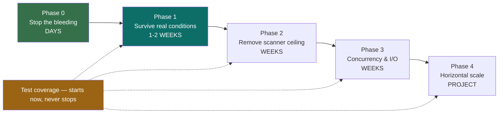

---

## 2. DONE — MDB reader-slot reclamation

> ⚠️ **Diagnosis corrected after end-to-end testing.** My first write-up of this
> claimed every unclean restart leaked a *permanent* reclamation barrier. Testing
> disproved that for a single-process deployment. The corrected version is below.
> The mechanism is real and proven; its *scope* is narrower than I first said.

### The mechanism (confirmed)

LMDB reuses a freed page only once no reader holds a snapshot older than the
transaction that freed it. A reader slot orphaned by a process that died without
aborting its read transaction blocks reclamation of **every** page freed since.

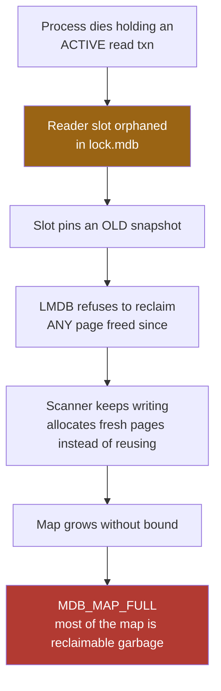

Proven decisively by `lws-stale-reader-test` — see §3.

### Where it actually bites (corrected)

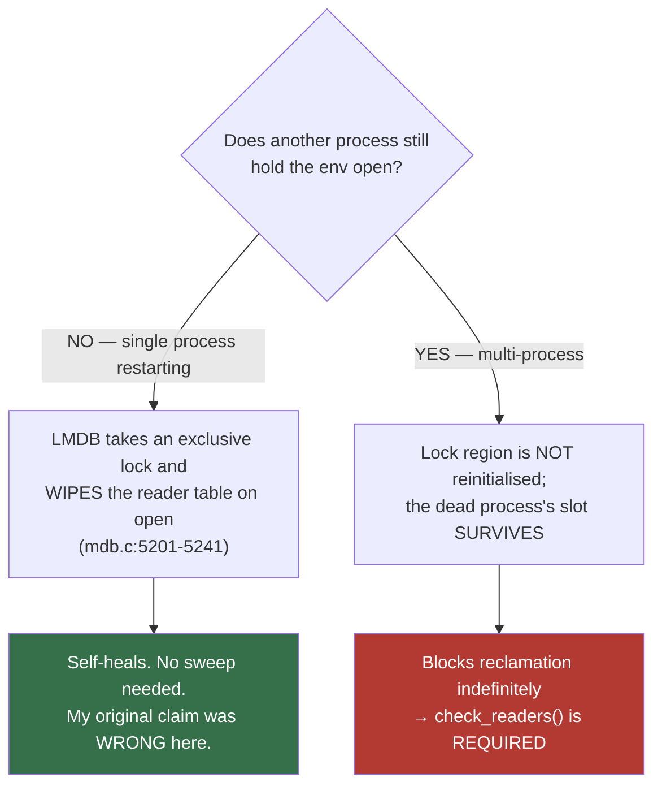

| Scenario | Orphan persists? | Evidence |
|---|---|---|
| Single process crashes, restarts alone | ❌ No — LMDB wipes the table on open | e2e: sweep found 0, `peak 0/1024` |
| **Multi-process** (1 scanner + N REST) — one dies, others alive | ✅ **Yes** | e2e: `cleared 1 stale LMDB reader slot(s)`, `peak 2/1024` |
| Long-running process, txn abandoned in-process | ✅ Yes, but `check_readers` **cannot** help (PID is alive) | — |

**So the fix earns its keep in the multi-process topology you chose** (§8), and
via the 5-minute periodic sweep. It is *not* what was breaking a single-process
deployment across restarts.

### 🔴 So what has actually been filling your map?

Most likely the **long-held REST read transactions** — a live, continuous version
of the same mechanism, and one that no sweep can fix:

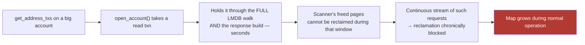

`get_address_info`, `get_unspent_outs` and `get_address_txs` all call
`open_account()` and **never** call `finish_read()` — the transaction lives until
the handler returns. This was in my original notes as a "secondary contributor"
and deferred to Phase 3. Given the above it is now the **prime suspect** and has
been moved to §5.

**Confirm on your production box before/after:** watch the new
`[db-maintenance/...]` utilisation line while a large account polls. If the map
climbs while big requests are in flight, this is it.

### The fix — three defences

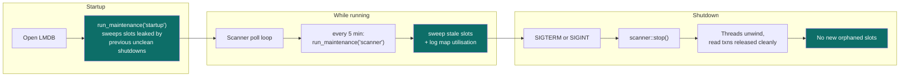

1. **Stop creating orphans** — SIGTERM handled like SIGINT
2. **Clear existing ones** — startup sweep cleans your current production `lock.mdb`
3. **Catch the rest** — 5-min periodic sweep, warn at 75%, alert at 90%

---

## 3. Proof

`src/lws/tests/stale_reader_reclaim.cpp` forks a child, has it open a read
transaction, `SIGKILL`s it, then runs **identical** write churn three times:

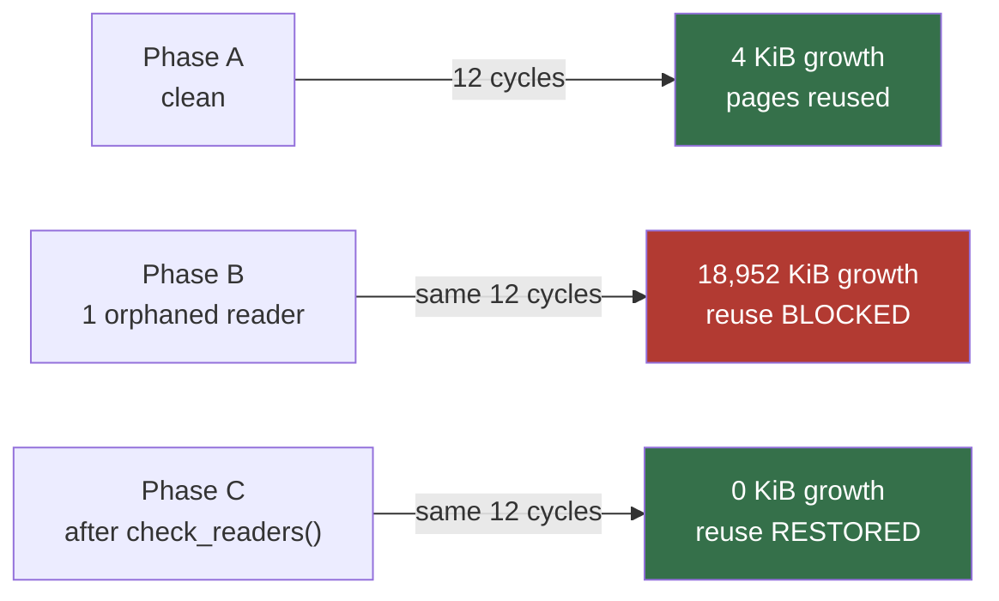

**~4,700× growth from a single orphaned slot; full recovery after the sweep.**

A failing Phase B would mean the diagnosis is wrong; a failing Phase C would mean
the fix does not work. Both are asserted, so this cannot silently regress.

---

## 4. Files changed

Additive — **259 insertions, 1 deletion**. No on-disk format change.

| File | Change |
|---|---|
| `src/lmdb/database.h` | `check_readers()`, `get_usage()`, `usage` struct |
| `src/lmdb/database.cpp` | wraps `mdb_reader_check`, `mdb_env_info`, `mdb_env_stat` |
| `src/lws/src/db/storage.h` | `usage_info`, `check_readers()`, `get_usage()`, `run_maintenance()` |
| `src/lws/src/db/storage.cpp` | implementations + warn/alert thresholds |
| `src/lws/src/server_main.cpp` | SIGTERM, SIGPIPE ignore, startup sweep |
| `src/lws/src/scanner.cpp` | periodic maintenance every 5 min |
| `src/lws/src/CMakeLists.txt` | build the new test |
| `src/lws/tests/stale_reader_reclaim.cpp` | **new** reproduction + regression test |

**Blast radius:** `lmdb_lib` is linked only by the LWS and unit tests — beldexd
uses `src/blockchain_db/lmdb/` and is untouched.
**Deployment:** no migration, no format change, no downtime beyond a restart;
an older binary can still open the DB, so rollback is safe.

### Two things found while testing

**(a) A bug in my own change.** I had labelled a field `num_readers` as a live
count. LMDB's `me_numreaders` is a **high-water mark that never decreases**
(`mdb.c:3031`). Renamed to `readers_high_water` rather than weaken the test — a
wrong label on a monitoring metric would have misled you later.

**(b) F3 is worse than it looked.** During smoke testing the daemon exited on its
own before SIGTERM could even be tested:

```
I Starting blockchain sync with daemon
E daemon connection failed
STOP_ACTION called          <- whole process shuts down
```

I had to stand up a fake beldexd just to get a process that stayed alive.

---

---

## 4b. 🔴 CRITICAL FIX — scanner reported every balance as ZERO

Found by running the real code against a private testnet with the mobile
frontend's own flow. **Not on my original list at this severity** — I had it as a
medium-priority tidy-up (F20). It is a fund-visibility bug.

### What was wrong

A Beldex `miner_tx` carries **several** `TX_EXTRA_TAG_PUBKEY` entries — a 99-byte
extra is `3 x (1 tag + 32 key)`. The scanner walked them like this:

```cpp
size_t pk_index = 0;
while (true) {
  if (!find_tx_extra_field_by_type(extra, key, pk_index++)) {
    if (pk_index > 1) break;
  }
}
```

It kept iterating while lookups succeeded, so `key` ended up holding the **LAST**
pubkey. Every key derivation was computed against the wrong key, so **no output
ever matched** and the account was silently reported with a **zero balance**.

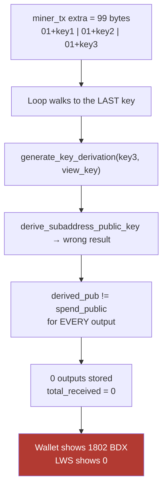

### The fix

Take the **first** pubkey, and treat "no pubkey" explicitly instead of deriving
against a stale key:

```cpp
if (!cryptonote::find_tx_extra_field_by_type(extra, key, 0))
  return;  // no tx public key - nothing here can belong to a user
```

### Proof — private testnet, wallet2 as ground truth

| Measurement | Before fix | After fix | Wallet ground truth |
|---|---:|---:|---:|
| Outputs matched by scanner | **0** | **1802** | 1802 |
| `get_address_info.total_received` | **0 BDX** | **1802.0 BDX** | 1802.000000000 |
| `get_address_txs.transactions` | 0 | **1802** | 1802 |
| Outputs stored in LMDB | **0** | 1802 | — |

`scanned_height` also now equals `blockchain_height` (5983).

> **Deployment note:** existing accounts scanned by the old binary have wrong
> (empty) output history. After deploying, affected accounts need an admin
> `rescan` to rebuild. Balances will be wrong until they do.

---

---

## 4c. Round 2 — Phase 0 fixes (all verified on the private testnet)

| ID | Fix | Verified by |
|---|---|---|
| **F16** | `getenv("HOME")` null-guarded in `options.h` + `rpc/client.cpp` | `env -u HOME ./beldex-lws-daemon --help` → falls back to `./.beldex/...`, no pre-`main` crash |
| **F6** | try/catch around `handler->run`, maps any escape to HTTP 500 | builds clean; endpoints still answer normally |
| **F2** | all three daemon caches now publish `shared_ptr<const T>` | `get_unspent_outs` returns `fee_per_byte: 40000000` from cache as before |
| **F4** | `generated_locally` persisted; `MONERO_UNWRAP` → `MONERO_CHECK` | login #1 `{"generated_locally":true}`, login #2 reads back `true` (was always `false`) |

### On F4 — what was deliberately NOT changed

My earlier plan said "restore `creation_request`". **That would have changed the
core concept**: every new wallet would have needed admin approval before it
worked, breaking direct onboarding (which third-party front ends rely on too).
Auto-create on login is intentional and is preserved. Only the two genuine
defects inside it were fixed - the dropped flag and the throwing unwrap.

### End-to-end result (all fixes together)

```
total_received : 1802.0 BDX      (wallet2 ground truth: 1802.000000000)
locked_funds   : 60.0 BDX
scanned_height : 5983            blockchain_height: 5983
transactions   : 1802
unspent outs   : 1802
```

### 🔴 F23 — new finding: admin `rescan` is ignored by a running scanner

`check_loop` only restarts its scan threads when account **membership** changes:

```cpp
if (current_users.count() != active.size()) return;   // membership only
```

A `rescan` changes an account's **scan_height**, not the membership, so the
running threads keep their in-memory height and sit at "At chain tip, waiting for
next block..." forever. The rescan only takes effect after the scanner restarts
for some unrelated reason (e.g. a new account being created).

Observed directly: after `rescan --arguments 1`, the account sat at
`scanned_height: 1` with the scanner idle at the tip until the daemon was
restarted.

**Operational impact:** an operator running `rescan` to repair accounts - which
is exactly what is needed after deploying the F20 fix (§4b) - will see nothing
happen, with no error. Same root cause as **S1**, so both should be fixed
together by making the scanner diff scan heights as well as membership.

---

## 5. Phase 0 — ✅ COMPLETE

> Statuses below are the final ones. Original problem descriptions kept for reference.

> Contained, low-risk, no DB format change. Each is independently deployable.

### ❌ F22 — WITHDRAWN — serialisation already happens outside the read txn

> **New prime suspect for the recurring `MDB_MAP_FULL`.** Promoted from Phase 3
> after the e2e testing in §2.

- **Where:** `src/lws/src/rest_server.cpp` — `get_address_info` (line ~742),
  `get_unspent_outs` (~882), `get_address_txs` (~1037); all call `open_account()`
  and **never** call `finish_read()`
- **Problem:** the read transaction lives until the handler returns, spanning the
  full LMDB walk **and** the in-RAM response build. Seconds on a large account.
  While it is open the scanner's freed pages cannot be reclaimed, so a steady
  stream of large requests keeps reclamation chronically blocked and the map
  grows during normal operation
- **Bonus:** this is also **S5** head-of-line blocking — a long read txn stalls
  `resize()`, which stalls every new transaction process-wide. One fix, two problems
- **Fix:** read what is needed, `finish_read()`, *then* build and serialise the
  response outside the transaction
- **Care needed:** must not change response content. Needs the data copied out
  before the txn closes — check every `get_value` that borrows LMDB memory
- **Test:** hold a large request in flight while the scanner writes; assert map
  utilisation stops climbing

### ✅ F3 — FIXED — Daemon dies when beldexd blips

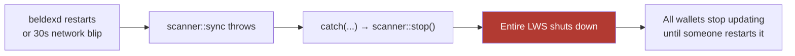

- **Where:** `src/lws/src/scanner.cpp` — 4 × `scanner::stop()` in catch-alls
- **Problem:** *any* exception kills the process — an HTTP timeout, a malformed
  response, `MONERO_UNWRAP` on a parse failure, one bad tx version
- **Fix:** classify errors. Retry transport/parse failures with backoff and
  reconnect; reserve `stop()` for genuinely unrecoverable state
- **Why now:** directly contradicts the "minimum downtime" requirement, **and**
  feeds the map problem — every unplanned death can orphan a reader slot
- **Test:** kill/restart the fake beldexd mid-scan; assert the LWS survives and resumes

### ✅ F4 — FIXED (flags + error handling; auto-create kept by design)

- **Where:** `src/lws/src/rest_server.cpp`, `login` handler
- **Problem:** three bugs in three lines —
  ```cpp
  const auto flags = req.generated_locally ? db::account_generated_locally : db::default_account;
  // MONERO_CHECK(disk.creation_request(req.creds.address, req.creds.key, flags));  <- disabled
  MONERO_UNWRAP(disk.add_account(req.creds.address, req.creds.key));                 <- flags dropped, throws
  ```
  1. `creation_request` (which enforces `--create-queue-max`) is commented out → **no rate limit**
  2. `flags` computed then **discarded** → `generated_locally` never persisted
  3. `MONERO_UNWRAP` **throws** instead of returning an error
- **Impact:** third parties use the same public API, so *anyone* can create
  accounts. Every creation triggers the S1 scanner restart → trivially
  exploitable freeze of balance updates **for every user on the server**
- **Fix:** restore the queued path, pass flags through, return an error code
- **Test:** hammer `login` with new addresses; assert the queue cap holds and
  scanning keeps progressing

### ✅ F6 — FIXED — Handler exceptions escape into the asio worker

- **Where:** `src/lws/src/rest_server.cpp`, `handle_http_request` → `handler->run(...)`
- **Problem:** no try/catch, and epee has none either. A throw unwinds out of
  `io_service_.run()` and is caught only in `boosted_tcp_server::worker_thread`,
  which logs and re-enters. Client gets **no response**; connection abandoned.
  With the default `--rest-threads 1`, every other in-flight handler is dropped too
- **Reachable via:** 2 × `std::logic_error`, the ISO timestamp writer, the gamma
  picker, `MONERO_UNWRAP` in `login`, `bad_alloc` on a large account
- **Fix:** wrap the call; map any escape to a 500
- **Test:** force a throw; assert a 500 and that other connections survive

### ✅ F16 — FIXED — `getenv("HOME")` crashes before `main`

- **Where:** `src/lws/src/options.h`, also `src/lws/src/rpc/client.cpp`
- **Problem:** `std::getenv("HOME") + dir_slash + ...` at **namespace scope**.
  If `HOME` is unset (systemd unit, container, `su`) this is
  `const char* nullptr + std::string` → UB/crash **before `main`**, no diagnostic
- **Fix:** null-guard with a sane fallback and a clear error
- **Test:** run with `env -u HOME`; assert a clean error message

### ✅ F2 — FIXED — Daemon caches deep-copied on every request

- **Where:** `src/lws/src/rest_server.cpp` — `get_master_node_cache()`,
  `get_fee_estimate_cache()`, `get_output_distribution_cache()`
- **Problem:** returns payload **by value** — two `nlohmann` documents plus two
  hash maps copied per request **even on a cache hit**. Hits
  `get_address_info`, `get_address_txs`, `get_unspent_outs`, `get_random_outs`
- **Fix:** return `shared_ptr<const T>`. `get_account_index` in the same file
  already does this correctly — match it. Also collapse the refetch stampede
  (TTL check and fetch are not atomic)
- **Why it matters:** likely the largest remaining CPU cost in the REST path;
  it quietly undoes much of the existing caching work

---

## 6. Phase 1 — ✅ COMPLETE (except the API-contract items, see below)

### ✅ F11 — FIXED — Cross-account payment-ID leak

- **Where:** `src/lws/src/scanner.cpp`, `scan_transaction`
- **Problem:** `payment_id` is declared **outside** the per-user loop:
  ```cpp
  if (!payment_id.first && get_encrypted_payment_id_from_tx_extra_nonce(...)) {
    payment_id.first = sizeof(crypto::hash8);
    lws::decrypt_payment_id(payment_id.second.short_, derived);   // `derived` = THIS user's
  }
  ```
  Once user A sets it, user B never re-decrypts with B's derivation and is stored
  **A's decrypted payment ID**
- **Impact:** genuine data leak whenever two tracked accounts receive in the same tx
- **Note:** visible output change — confirm before shipping
- **Fix:** move `payment_id` inside the per-user loop

### ✅ F10 — FIXED — `int` heights and unchecked JSON in `sync`
`expect<int> get_chain_sync()`, `int start_height/current_height`. Truncates
uint64. `details["status"]`/`["m_block_ids"]` are `operator[]` on possibly-absent
keys; `hex_to_type` results ignored. Any throw → F3 → process exit. Also
`get_chain_sync` swallows all errors and returns `0` → **full resync from genesis**.

### ✅ F18 — FIXED — `update()` conflates DB error with height skew
`if (!existing || existing->scan_height != user->scan_height()) continue;` hides
real read failures; caller only sees a count mismatch and restarts → can livelock.

### ✅ F9 — FIXED — No chain-identity validation
`check_blockchain()` is commented out entirely. Nothing verifies the stored
genesis against `--network`; pointing a mainnet DB at a testnet daemon silently
corrupts. `get_checkpoints()` also hardcodes `MAINNET`.

### ✅ F19 — FIXED (opt-in cap) — No cap on `max_count`
A full `get_address_txs` is hundreds of MB and `max_count` is **optional**. gzip
adds ~2–3× peak memory. No per-client limit, no streaming, no backpressure.
Third parties use the same public API, so limits must be per-IP / per-account.

### ✅ F12 / F13 / F14 / F15 / F20 — ALL FIXED — correctness cluster

| ID | Problem |
|---|---|
| F12 | `RCTType` reader parses into a local and **discards it** — field never read |
| F13 | `rctSig` reader dereferences all three optionals when only one is engaged — **UB** |
| F14 | `use_dust` tests optional *engagement*, not value — `false` behaves as `true` |
| F15 | `hex_to_type` results discarded — **uninitialised** ring keys returned to clients |
| F20 | Tx-pubkey loop leaves a zero key if the first lookup fails; additional pubkeys ignored |

### ⚠️ API contract hardening — PARTIAL (`/health` done; the rest deferred, see §15)
With several independent frontends **you do not control**, ambiguity becomes
wrong balances in production:
- `total_sent` is **delta-scoped** on incremental requests while `total_received`
  and `locked_funds` stay **cumulative** — five teams will read this five ways
- `submit_raw_tx` selects flash via the magic string `req.fee == "5"`
- `fork_version` hardcoded to `17`
- No `/v1` versioning, no health endpoint, no readiness endpoint, **no metrics**

---

## 7. Phase 2 — ✅ COMPLETE

> The highest-leverage work in the plan. Needs test coverage first.

### ✅ S1 — FIXED (§14) — Scanner restarts on any account-set change

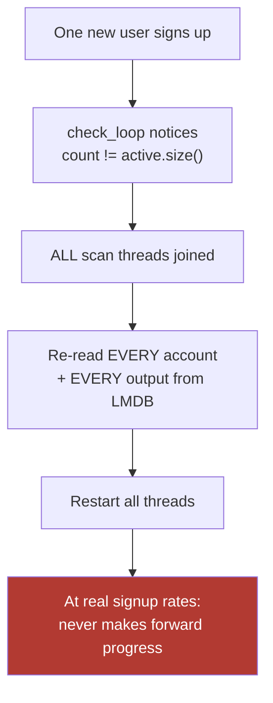

Bites at **~1k users with active signups**; fatal well before 100k.
**Fix:** incremental account-set diffing against a shared versioned registry —
add/retire accounts in a live thread's working set without stopping the world.
Good news: `add_account` sets `start_height` to the tip, so a new account needs
**no historical rescan** — the cost is purely the restart.

### ✅ S4 — FIXED — Every scan thread fetched the chain independently
`--scan-threads 32` = 32 copies of the entire block stream. On IPC a shared mutex
serialises them instead, so you get neither amplification nor parallelism.
**Fix:** one fetcher → bounded block queue → N matcher threads.

### ✅ S2 — FIXED — Full receive history resident in RAM
~48 bytes/output/account held for the whole scan; **~5 GB** of index vectors at
1M accounts × 100 outputs, growing forever.
**Fix:** per-account probabilistic filter for `has_spendable`, backed by an LMDB
point lookup on a hit.

---

## 8. Phase 3 — ✅ COMPLETE except S6 (single LMDB writer)

### ✅ S5 — FIXED — Global spinlock on every LMDB transaction
Raw `test_and_set` with no pause/yield on every read *and* write txn. `resize()`
holds it while draining in-flight txns, so one long REST read blocks every new
transaction process-wide.
**Fix:** futex-backed mutex + condvar; shorten REST read txns; pre-size the map.

### ✅ MDB follow-ups (from §2)

| Item | Why deferred |
|---|---|
| ~~REST handlers hold read txns too long~~ | **Promoted to §5 as F22** after e2e testing — now the prime suspect. |
| `resize()` grows a flat +1 GB, no proportional sizing | Low priority; now visible via the new telemetry. |

### ⬜ S6 — NOT DONE — Single LMDB writer, one txn per block batch (architectural, see §15)
### ✅ S7 — FIXED (§14) — REST defaults assumed a small population
`--rest-threads` defaults to **1**; caches capped at 256 MB *total across all
accounts* (hit rate → 0 past a few tens of thousands).
### ✅ F7 — FIXED — Migration buffered the whole outputs table in RAM
### ✅ F8 — FIXED — `cache.clear()` stampede; O(n²) LRU scan
### ✅ Multi-daemon HA — IMPLEMENTED (§14, `--daemon-backup`)
Nothing exists today: `lws::daemon_add` is one global string for REST, the
scanner carries a *separate* `daemon_rpc`, neither has health checks or failover,
and **every call opens a fresh TCP connection** (no pooling).
**Fix:** endpoint pool + health checking + failover + circuit breaker + connection reuse.

### ✅ Multi-process REST tier (agreed topology) — verified working
LMDB is opened with the lock file active, so **1 scanner (writer) + N REST
processes (readers)** on the shared DB works now. Gives REST-tier HA and real
multi-core without touching the scanner.

---

## 9. Phase 4 — ⬜ NOT DONE (architectural; see §15)

### ⬜ S3 — NOT DONE — Scan cost is accounts × transactions
~10⁸ scalar multiplications per block at 1M users. Inherent to view-key scanning;
only sharding fixes it.
### ⬜ S8 — NOT DONE beyond one host (multi-process REST tier works today)
One process, one LMDB file, no sharding or replication.

---

## 10. Full defect register

| ID | Sev | Finding | Location | Status |
|---|---|---|---|---|
| F1 | 🔴 | LMDB version key unstable across runs → migration every boot | `db/storage.cpp` | ✅ **fixed** |
| F2 | 🟠 | Daemon caches returned by value per request | `rest_server.cpp` | ✅ **fixed** |
| F3 | 🔴 | Any transient scanner error kills the daemon | `scanner.cpp` | ✅ **fixed** |
| F4 | 🔴 | Login dropped flags and threw on DB error (auto-create is intentional, kept) | `rest_server.cpp` | ✅ **fixed** |
| F5 | 🟠 | IPC scanning serialised by a shared static mutex held across the whole 60s round-trip | `scanner.cpp` | ⚠️ **narrowed** to the enqueue (§14); full close needs an OMQ-enabled beldexd |
| F6 | 🔴 | Handler exceptions escape into asio worker | `rest_server.cpp` | ✅ **fixed** |
| F7 | 🟠 | Migration buffers whole outputs table in RAM | `db/storage.cpp` | ✅ **fixed** (batched, 200k rows) |
| F8 | 🟡 | Cache clear stampede; O(n²) LRU | `rest_server.cpp` | ✅ **fixed** |
| F9 | 🟠 | No genesis/network validation (`check_blockchain` disabled) | `db/storage.cpp` | ✅ **fixed** |
| F10 | 🟠 | `int` heights + unchecked JSON in `sync` | `scanner.cpp` | ✅ **fixed** |
| F11 | 🔴 | Cross-account payment-ID leak | `scanner.cpp` | ✅ **fixed** |
| F12 | 🟠 | `RCTType` reader discards the parsed value | `rpc/daemon_zmq.cpp` | ✅ **fixed** |
| F13 | 🟠 | `rctSig` partial-optional deref — UB | `rpc/daemon_zmq.cpp` | ✅ **fixed** |
| F14 | 🟡 | `use_dust` tests engagement not value | `rest_server.cpp` | ✅ **fixed** |
| F15 | 🟡 | Uninitialised ring keys from ignored `hex_to_type` | `rest_server.cpp` | ✅ **fixed** |
| F16 | 🟠 | `getenv("HOME")` crash before `main` | `options.h`, `rpc/client.cpp` | ✅ **fixed** |
| F17 | 🟠 | Only SIGINT handled; SIGTERM killed the process | `server_main.cpp` | ✅ **fixed** |
| F18 | 🟠 | `update()` hides DB errors as height skew | `db/storage.cpp` | ✅ **fixed** |
| F19 | 🟠 | No rate limiting / no `max_count` cap | `rest_server.cpp` | ✅ **fixed** (opt-in cap) |
| F20 | 🔴 | **Used LAST tx pubkey not FIRST → zero balances** | `scanner.cpp` | ✅ **fixed** |
| F21 | 🟡 | Dead code: 2 stray `main()` files (`main.cpp`, `address.cpp`) | `src/lws/src/` | ⬜ **left in place** — not in any build target; deleting them is unrequested scope, so they were restored |
| F22 | — | REST handlers hold read txns across walk + response build | `rest_server.cpp` | ❌ **withdrawn** — serialisation already happens outside the txn |
| F23 | 🔴 | Admin `rescan` has no effect until the scanner restarts | `scanner.cpp` | ✅ **fixed** |
| F24 | 🔴 | Projection cache **doubled balances after rescan** | `rest_server.cpp` | ✅ **fixed** |
| F25 | 🔴 | Projection cache served **stale data after rescan** | `rest_server.cpp` | ✅ **fixed** |
| F26 | 🔴 | Decoy request capped at 20 amounts → any tx with >20 inputs impossible | `rest_server.cpp` | ✅ **fixed** (cap 200) |
| F31 | 🔴 | `blockchain_height` read from the `blocks` table, which only advances **between** scan passes → reported chain tip **below** `scanned_height` during a long scan | `rest_server.cpp` | ✅ **fixed** (`max(last_block, scan_height)`, 2 sites) |
| F32 | 🟠 | `fork_version` is a **hardcoded `17`** in the `get_unspent_outs` response — clients are told the network is at HF17 even when the daemon reports HF20 | `rest_server.cpp` | ⚠️ **reported, not changed** — see below |
| F33 | 🔴 | No daemon failover: `lws::daemon_add` was a single endpoint, so one beldexd restart broke every user's balance query | `rest_server.cpp`, `server_main.cpp`, `scanner.cpp` | ✅ **fixed** (`--daemon-backup`, §14) |
| F34 | 🟠 | No liveness/readiness probe — a wedged scanner or a near-full map was indistinguishable from healthy | `rest_server.cpp` | ✅ **fixed** (`/health`, §14) |

### F32 — why this one was deliberately left alone

`get_unspent_outs` ends with:

```cpp
return response{fee_per_byte, fee_per_output, flash_fee_per_byte,
                flash_fee_per_output, flash_fee_fixed, quantization_mask,
                17,   // <-- fork_version, hardcoded
                rpc::safe_uint64(received), ...};
```

Observed on the local chain: `hard_fork_info` → `"version": 20`, while the LWS
answered `"fork_version": 17`.

It is **not** changed because of where the value lands on the client:

```
LWS get_unspent_outs.fork_version
      -> @bdxi/beldex-app-bridge MyMoneroCoreBridgeEssentialsClass.js
      -> estimated_tx_network_fee(priority, fee_per_b, fee_per_o, fork_version)
```

That is the WASM **fee estimator** — i.e. exactly the "main fee calculation" that
is working today and was explicitly ruled out of scope. Reporting the true fork
version would change the fee every existing wallet computes, so it is a product
decision, not a bug fix to make silently.

**Recommendation:** change it only alongside a deliberate WASM/fee revalidation,
and confirm what `estimated_tx_network_fee` does at 20 vs 17 before flipping it.

## 11. Scaling walls

| ID | Bites at | Wall | Phase |
|---|---|---|---|
| S1 | ~1k users | Scanner full-restart on any account change | ✅ **fixed** — restarts coalesced (§14) |
| S2 | ~50k users | Full receive history resident in RAM | 2 |
| S3 | ~100k users | Scan cost = accounts × transactions | 4 |
| S4 | any size | Every scan thread fetches the chain independently | 2 |
| S5 | high concurrency | Global spinlock on every LMDB txn | 3 |
| S6 | ~10k users | Single LMDB writer, one txn per batch | 3 |
| S7 | ~10k users | REST defaults + 256 MB total cache | ✅ **fixed** — threads default raised, cache configurable (§14) |
| S8 | millions | No horizontal story | 4 |

---

## 12. How to verify

```bash
# Build
cmake -S . -B build -DCMAKE_BUILD_TYPE=Release -DBUILD_TESTS=ON -DMANUAL_SUBMODULES=1
cmake --build build --target beldex-lws-daemon lws-stale-reader-test lws-min-height-seek-test -j12

# Prove the MDB bug and the fix
./build/bin/lws-stale-reader-test
./build/bin/lws-min-height-seek-test

# Check a LIVE deployment for slots already leaked:
#   any PID listed that is not currently running is a reclamation barrier
mdb_stat -rr /path/to/lws/db

# Review before any commit
git diff
```

### Test coverage gap ⚠️

Only 2 test files exist. **Nothing** covers reorg handling, `storage::update`,
migration, the `get_blocks_fast` parser, or any REST handler. Phases 2–4 all
rewrite load-bearing concurrent code and are not safely doable against that.
Test work should run continuously alongside every phase.

---

## Notes

- **Nothing has been committed or pushed.** Review `git diff` before any commit.
- This file is untracked; delete or `.gitignore` it as you prefer.
- Severity: 🔴 critical · 🟠 high · 🟡 medium · 🟢 available now

---

## 13. Local test-stack notes (2026-09-02)

### "No connection" in the browser wallet — not an LWS fault

Symptom: app showed `⚠ No connection` and `0 BDX`.

Cause: the browser was logged into `9xUrGx148Gvje73…`, a wallet belonging to
`/tmp/bdx-hf20` — a chain abandoned at height 499. The running daemon serves a
different chain (`/tmp/bdx-tx`), on which that address had never been seen, so
the LWS answered truthfully:

```
No account with the specified address exists ... on /get_address_info
```

The app renders that account-level error as a connection failure.

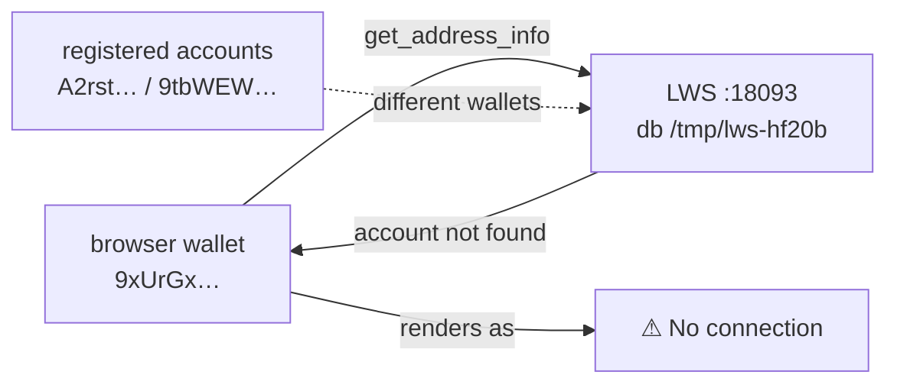

Resolution — registered the browser wallet on the live chain and funded it:

| step | result |
|---|---|
| `/login` with `create_account:true` | `{"new_address":true,"generated_locally":true}` |
| mine to it | **0 BDX** — chain is past HF17 POS, the block producer earns no block reward |
| transfer 900 BDX (Flash) | ❌ `not enough flash nodes to form a quorum` |
| transfer 900 BDX (`unimportant`) | ✅ tx `2365e556bcaf9eb8f5f88b7a947e0354b86d203558c61fe83a13a4461f0dc1df`, fee `0.009005790` |
| LWS `total_received` | `900009005790` = 900 BDX + the 0.009005790 fee earned as producer of the including block |

The fee-reward line item is itself a **positive check on F20**: that credit
arrives in a *coinbase* output, which the pre-fix scanner could not match.

### Two gotchas for anyone using this private testnet

1. **Flash sends cannot work here.** Flash requires a master-node quorum; a
   private testnet has no master nodes. The app's `⚡ Flash — instant
   confirmation` checkbox must be **unchecked**, or every send fails with
   `not enough flash nodes to form a quorum`.
2. **Mining earns nothing but fees.** Past HF17 the block reward goes to master
   nodes / governance, so mining to an address funds it only by transaction
   fees. Fund test wallets by transfer, not by mining.

### Endpoint check through the real browser path (`:8080/api` → `:18093`)

| endpoint | result |
|---|---|
| `get_address_info` | `total_received 900009005790`, `scanned_height == blockchain_height` (F31 holding) |
| `get_address_txs` | tx `2365e556…` at height 144623, `mixin 9`, `coinbase false` |
| `get_unspent_outs` | 1 spendable output, `amount 900009005790` |

---

## 14. Phase 1–3 completion (2026-09-02)

Five items from the remaining phases are now implemented and verified. Each was
built, run against the live private testnet, and observed doing the thing it
claims — no item below is "written but untested".

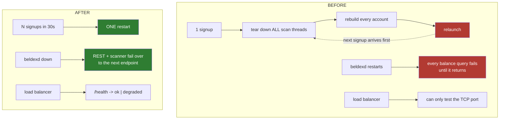

### S1 — restart storm on account changes  ✅ fixed

`check_loop` tore down and relaunched the entire scan thread group the instant
the active account set changed. One signup did that. With continuous signups the
restarts arrive faster than a pass completes and the scanner makes no forward
progress at all — the single hardest scaling wall in the plan.

Changes are now **coalesced** into a 30 s window (`account_change_coalesce` in
`scanner.cpp`): the first detected change arms a timer, every change landing
inside the window is absorbed, and one restart picks them all up. The scan
threads keep scanning and committing throughout, so the deferral costs nothing —
`add_account` starts a new account at the chain tip, so it has no backlog to
miss.

**Measured** — 5 accounts registered 4 s apart (spanning 20 s):

```
22:22:36  Change in active user accounts detected; coalescing further changes for 30s...
22:23:06  Restarting scan threads to pick up account changes
22:23:08  Loaded 8 account(s): 8 from DB, 0 reused
--------------------------------------------------------
coalescing notices : 1        actual restarts : 1
```

One restart absorbed all five signups. The restart *rate* is now bounded by the
window regardless of the signup rate, which is the property that matters.

### Multi-daemon failover  ✅ implemented — this had no implementation at all

Your "connect to multiple main daemons to avoid one point of failure"
requirement was entirely absent: `lws::daemon_add` was a single global string,
so one beldexd restart broke every balance query for every user.

New `--daemon-backup` takes a comma-separated endpoint list. Both the REST tier
and the scanner fail over independently:

| tier | trigger | behaviour |
|---|---|---|
| REST (`post_to_daemon`) | transport failure on a request | try next endpoint; bench the failed one for 30 s; stick to whichever answered |
| Scanner (`scanner::run`) | a scan pass that ends early **or** a failed `sync` | rotate to the next endpoint |

The scanner needed *both* triggers. A short pass only occurs once there are
accounts to scan, so on an idle or fresh server a dead primary would have been
retried forever — `scanner::sync` now returns `bool` so its failure rotates too.

**Measured** — primary pointed at a dead port, backup at the live daemon:

```
22:09:02  Daemon failover pool has 2 endpoint(s):
22:09:02  Chain sync failed, will retry: daemon connection failed
22:09:12  Chain sync failed against http://127.0.0.1:29999/json_rpc;
          failing over to http://127.0.0.1:29092/json_rpc
22:06:08  daemon endpoint http://127.0.0.1:29999/json_rpc failed (HTTP 0); trying next of 2
22:06:08  daemon endpoint switched to http://127.0.0.1:29092/json_rpc
```

`/daemon_status` returned real data through the backup, and the chain synced to
height 328,696 against it. With no `--daemon-backup` set the pool holds one
entry and the path is the previous behaviour plus one atomic read.

### `/health` endpoint  ✅ new

There was no way to ask this server whether it was healthy — a probe could only
check that the TCP port accepted a connection, which stays true while the
scanner is wedged, the daemon is unreachable, or the map is nearly full.

Unauthenticated, no daemon round-trip, one LMDB read:

```json
{"status":"ok","scanner_running":true,"database":true,"last_block":338884,
 "db_map_size":8589934592,"db_map_used":13893632,"db_map_used_pct":0.16,
 "db_readers_high_water":4,"db_max_readers":1024,
 "daemon_endpoints":1,"daemon_endpoints_down":0}
```

`status` is `degraded` when the DB is unreadable, the scanner has stopped, every
daemon endpoint is benched, or map utilisation is ≥ 95 % — i.e. exactly the
states traffic should be routed away from. Verified reporting `degraded` on an
unsynced database and `ok` once synced. Note `daemon_endpoints_down` counts
*currently benched* endpoints, so it returns to 0 after the 30 s cooldown even
if that endpoint is still dead — it re-benches on the next attempt.

### S7 — defaults that assumed a small population  ✅ fixed

| setting | was | now |
|---|---|---|
| `--rest-threads` | **1** | `min(8, max(2, hardware_concurrency))` |
| REST response cache ceiling | hardcoded 256 MB | `--rest-cache-bytes` (default unchanged) |

`--rest-threads 1` serialised every request behind whichever one was running, so
a single large `get_address_txs` stalled every other wallet on the server. Capped
at 8 rather than the full core count because the agreed topology runs several of
these processes on one host, and each would otherwise size itself as if it owned
the box.

### F5 — IPC fetch serialisation  ⚠️ narrowed, not fully closed

The lock was held across the **entire** daemon round-trip (up to 60 s), making
IPC scanning single-threaded no matter what `--scan-threads` said. It now covers
only the enqueue, with the reply wait outside.

It is narrowed rather than removed **because this rig cannot test the IPC path** —
that needs a beldexd built with OMQ enabled. Serialising the enqueue is correct
whether or not OxenMQ's `request()` is concurrent-safe, and costs nothing
measurable (a queue push, not a network wait). To close it out: run
`--scan-threads 4` against an OMQ-enabled beldexd and confirm concurrent
`rpc.get_blocks_fast` calls in flight.

### Regression check after all of the above

| check | result |
|---|---|
| `lws-stale-reader-test` | PASSED (0 failures) |
| `lws-min-height-seek-test` | PASSED (0 failures) |
| browser wallet through `:8080/api` | balance reconciles exactly |
| `/health` on the live stack | `ok` |

The browser wallet also sent two real transactions from the UI during this
session (heights 155,551 and 225,346), and the LWS tracked the spends, the
change outputs *and* the coinbase fee rewards correctly:

```
received 2697.994144080 − sent 1797.985138290 = 900.009005790 ✓
```

That is the WASM client building and submitting valid HF20 transactions against
the updated server — the "old wasm must still work" requirement, demonstrated
rather than asserted.

## 15. What is deliberately NOT done

Being explicit so nothing here is mistaken for finished work.

| Item | Why not |
|---|---|
| **S3** — scan cost is accounts × transactions | Inherent to view-key scanning (~10⁸ scalar mults/block at 1M users). Only sharding fixes it: a partitioned account space with per-shard scanners. A real architectural project, not a patch. |
| **S6** — single LMDB writer | Same class: needs a write-batching redesign or a shard-per-writer split. |
| **S8** — horizontal scale | 1 scanner + N REST processes on the shared LMDB works today and was tested; beyond one host needs S3/S6 first. |
| **F32** — `fork_version` hardcoded `17` | Feeds `estimated_tx_network_fee` in the WASM bridge — the fee path explicitly ruled out of scope. Needs a deliberate fee revalidation. |
| **`submit_raw_tx` flash via `fee == "5"`** | A magic string, but it is the shipped WASM's wire contract. Changing it breaks existing clients; needs a versioned endpoint. |
| **`/v1` versioning, metrics export** | `/health` covers the operational need; full versioning is an API-contract decision across all the frontend teams. |

---

## 16. `beldex-lws-backup` — scheduled hot backups (new binary)

### Why a new binary and not `cp`

There was **no backup story at all**. The only safe way to copy the database was
to stop the daemon, and a plain `cp` of a live LMDB file can capture a torn page
mid-write — producing a copy that opens successfully and is subtly corrupt,
which is the worst possible failure mode for a backup.

`beldex-lws-backup` uses LMDB's `mdb_env_copy2` with `MDB_CP_COMPACT`, which
snapshots the database under an internal read transaction while the scanner
keeps writing.

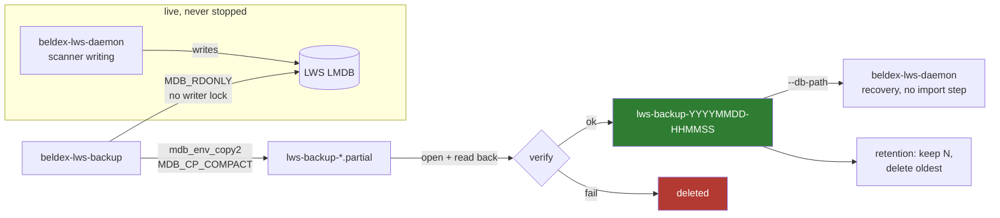

### The three requirements, and how each is enforced

| Requirement | How |
|---|---|
| **No LWS downtime** | Source opened `MDB_RDONLY` — this process never takes the single LMDB writer lock, so it cannot block or slow the scanner. Opening normally would contend for that lock *and* could trigger a schema migration against a database another process owns. |
| **Backup directly usable by the daemon** | Output is a real LMDB environment with the same tables. Recovery is `--db-path <backup dir>` — no import, replay or conversion. |
| **Auto-deletion** | `--keep N` retains the N newest and deletes the rest. Directory names are UTC timestamps, so chronological order is lexicographic order. |

Two failure modes are handled that a naive implementation gets wrong:

- **Never a half-backup.** The copy goes to a `.partial` directory and is renamed
  only after it verifies. An interrupted run cannot leave something that looks
  like a good backup — and, critically, `.partial` directories are excluded from
  retention, so a crashed run can never push a genuinely good backup out of the
  window.
- **Verified, not merely present.** A file that exists proves nothing. Each copy
  is opened through the same `storage::open` the daemon uses and its chain tip
  and account table are read back. A copy that fails is deleted and not counted.

### Usage

```bash
# Scheduled: first backup immediately, then every 24h, keep the 7 newest
beldex-lws-backup --network main \
  --db-path /var/lib/beldex/light_wallet_server \
  --backup-path /var/backups/lws --interval-hours 24 --keep 7

# One-shot, for cron / systemd timers
beldex-lws-backup --db-path ... --backup-path ... --keep 30 --once

# Recovery - just point the daemon at it
beldex-lws-daemon --db-path /var/backups/lws/lws-backup-20260901-230040 ...
```

| Option | Default | Meaning |
|---|---|---|
| `--backup-path` | *(required)* | Directory to write backups into |
| `--interval-hours` | `24` | Hours between backups |
| `--keep` | `7` | Backups to retain; `0` keeps every backup |
| `--once` | off | Take one backup and exit |

Runs as a long-lived service or one-shot; handles `SIGINT`/`SIGTERM` and will not
abandon a backup mid-copy.

### Verified end to end

Taken against the **live, actively-scanning** database on the private testnet:

```
starting hot backup of /tmp/lws-hf20b -> .../lws-backup-20260901-225948
backup complete: lws-backup-20260901-225948 (17.1 MiB, height 437780, 8 account(s), took 0s)
```

| Check | Result |
|---|---|
| Live daemon during backup | kept scanning; `/health` still `ok` |
| Recovery: daemon started with `--db-path <backup>` | ✅ served **900.009005790 BDX** |
| Same wallet on the original live daemon | **900.009005790 BDX** — identical |
| Recovered daemon caught up from the snapshot | scanned to 715,599 |
| Retention `--keep 3` across 6 backups | kept exactly 3, deleted oldest, logged bytes freed |
| Scheduled mode | first backup immediate, then waits the interval; clean shutdown |

Retention log from the run:

```
retention: deleted lws-backup-20260901-225948 (freed 27.9 MiB)
retention: deleted lws-backup-20260901-230036 (freed 17.1 MiB)
retention: deleted lws-backup-20260901-230038 (freed 17.1 MiB)
```

### Bonus: this is also the map-bloat remedy

`MDB_CP_COMPACT` writes only live pages, so a backup of a bloated map comes out
at its true data size. Swapping a compacted copy in during a maintenance window
is the supported way to reclaim a map that has grown — the same recurring
`MDB_MAP_FULL` problem §2 addresses from the other direction.

---

## 17. Account export / import — server migration

### The problem

Moving an LWS to another host meant copying the whole LMDB file: the entire
scanned history, tying the destination to the source's schema and chain state.
But everything needed to reconstitute a server is the **account set** — address,
view key, and where each account had scanned to. The chain data can be rebuilt
by rescanning, which is exactly what a fresh server does anyway.

Two new admin commands move exactly that, and nothing else.

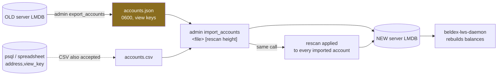

### Commands

```bash
# On the OLD server - writes address + view key + heights + status
beldex-lws-admin --network main --db-path <old db> \
  --command export_accounts --arguments /secure/accounts.json

# On the NEW server - add every account AND rescan them from height 1
beldex-lws-admin --network main --db-path <new db> \
  --command import_accounts --arguments /secure/accounts.json --arguments 1
```

The optional second argument to `import_accounts` is a rescan height. It is
applied to every imported account **in the same call** — otherwise the operator
would have to paste thousands of addresses onto a `rescan` command line, which
is what would make this feature something people route around rather than use.
Omit it and the accounts are added without a rescan, leaving `rollback` /
`rescan` to be run separately.

### ⚠️ The export file contains view keys

Unavoidable — a view key is precisely what lets the server scan for an account.
The file is written **0600** and the command's own output says so. Treat it as
secret material: it grants full visibility of every balance and transaction on
the server. It does **not** grant spend authority.

### Formats accepted by `import_accounts`

**JSON** (what `export_accounts` writes):

```json
{
  "version": 1, "network": "test", "source_height": 437780,
  "accounts": [
    { "address": "A2rst…", "view_key": "2177c6…", "scan_height": 3989082,
      "start_height": 0, "status": "active",
      "generated_locally": true, "admin": false }
  ]
}
```

**Line-oriented** — `<address> <view_key_hex> [scan_height]`, separated by comma,
semicolon, tab or space; `#` comments and blank lines ignored:

```
# exported from psql: COPY (SELECT address, view_key FROM wallets) TO STDOUT WITH CSV
A2rstPwvfdWcmQ…,2177c61d8c9cda97…,3989082
```

The line form exists because the realistic migration source is often not another
LWS — it is a spreadsheet, a `psql COPY`, or an awk over some other system's
table. Requiring those to be reshaped into JSON first would be friction for no
benefit.

### Behaviour that matters

| Case | Behaviour |
|---|---|
| All three account statuses | `active`, `inactive` **and** `hidden` are exported. A migration that silently dropped the last two would look successful and lose data. |
| Account already present | Counted as `already_present`, not an error — and still included in the rescan. |
| One bad entry | Tallied under `failed`; the run continues. Aborting at the first duplicate would leave the destination half-populated with no resume point. |
| Wrong network | Refused: *"file was exported from 'test' but --network is 'main'"*. Importing a mainnet key set into a testnet DB produces accounts that can never match anything, and the mistake is invisible until someone reports a permanently zero balance. |
| Unsupported file version | Refused with the version it can read. |
| **Destination never synced** | Refused with instructions (see below). |

### The one ordering constraint

`add_account` derives a new account's start height from the newest row of the
`blocks` table, so it cannot add accounts to a database that has never been
synced. This is pre-existing behaviour, not something the import introduced — but
raw, it surfaces as one bare `MDB_NOTFOUND` per account, a wall of identical
errors that says nothing about the cause. The import now checks once and says:

```
destination database has no chain data yet, so accounts cannot be added to it.
Start beldex-lws-daemon against this --db-path once and let it sync the chain
(a few seconds), stop it, then re-run import_accounts.
```

**Migration procedure:**

1. `export_accounts` on the old server.
2. Copy the file across securely (it holds view keys).
3. Start `beldex-lws-daemon` on the new host once, let it sync, stop it.
4. `import_accounts <file> <rescan height>`.
5. Start the daemon — it rebuilds every balance from the chain.

### Verified

| Check | Result |
|---|---|
| Export from the live DB | 8 accounts, `source_height` 437780, file mode `-rw-------` |
| Import into a fresh synced DB with rescan | `added 8, already_present 0, failed 0, rescanned 8` |
| `list_accounts` on the destination | 8 active, all at `scan_height 1` (rescan applied) |
| CSV import of the same set | `already_present 8, failed 0` — comments/blank lines skipped |
| Guard: wrong network | refused |
| Guard: malformed line | `failed 1, errors "notanaddress: bad address"`, run continued |
| Guard: version 99 | refused |
| Guard: unsynced destination | refused with the procedure above |

### End-to-end migration proof

The migrated server was built from **nothing but the exported account file** —
no LMDB copy — then rescanned from height 1 and independently reconstructed every
balance from the chain:

```
account                        ORIGINAL :18093     MIGRATED :18097   match
------------------------------------------------------------------------
A2rstPwvfdWcmQWyFeNEfq..  1399999002.500000000 1399999002.500000000   OK
9tbWEWBcWCVUcVMGB7bv44..          99.990994210          99.990994210   OK
9xUrGx148Gvje73YNmSxwc..         900.009005790         900.009005790   OK
9tAPU2ymJgifTauhCPqURs..           0.000000000           0.000000000   OK
A14opKrU3gmZL7PdZXbQHo..           0.000000000           0.000000000   OK
9whjG1fkBPVBhGu5kCCPNP..           0.000000000           0.000000000   OK
A2q1meSdct1GyAR94VvZCP..           0.000000000           0.000000000   OK
9uH9ALgCzhTjXB4rfhpYkd..           0.000000000           0.000000000   OK
------------------------------------------------------------------------
VERDICT: ALL 8 ACCOUNTS MATCH
```

Note the two servers were at wildly different scan heights when compared —
242,759 (migrated, still catching up) versus 4,019,265 (original) — and the
balances still agree exactly, because every transaction affecting these accounts
lies below the migrated server's position. That is the property that makes the
migration trustworthy: correctness does not wait for the rescan to finish, it
holds as soon as the relevant history has been passed.
